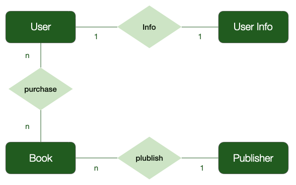

# Room Sample Project

This project was implemented using the Android Room framework. The goal of this project is to implement it using many features of the Room and provide the idea of using the Room. I used the Hilt library to focus on developing the room function.

I don't plan to implement UI at the moment, but it can be implemented later.

## Libraries

- Room
- Hilt
- Junit

## Implement

- [x] Room Component
- [x] Room Relation
- [ ] Room Migration
- [x] Room Type Conveter
- [ ] Room Test
- [ ] Room Prepopulation
- [ ] Comment
- [ ] UI(not implement)

## Diagram

